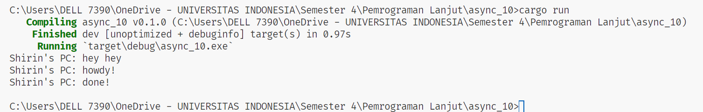

**1.2. Understanding how it works.**

Terlihat bahwa fungsi async akan dijalankan di luar fungsi utama yang menjalankannya. Oleh karena itu, "hey hey" bisa keluar terlebih dahulu sebelum "howdy!" dan "done!" karena "hey hey" berada di luar fungsi async sementara fungsi tersebut masih menunggu hasil dari future.