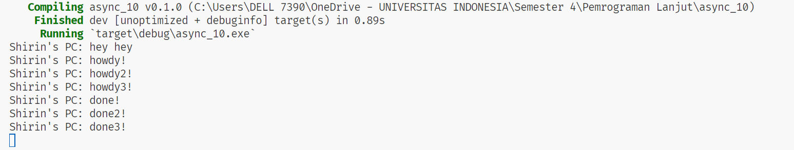

**1.2. Understanding how it works.**

Terlihat bahwa fungsi async akan dijalankan di luar fungsi utama yang menjalankannya. Oleh karena itu, "hey hey" bisa keluar terlebih dahulu sebelum "howdy!" dan "done!" karena "hey hey" berada di luar fungsi async sementara fungsi tersebut masih menunggu hasil dari future.
**1.3. Multiple Spawn and removing drop**

Terlihat bahwa adanya banyak spawner menyebabkan lebih banyak tugas dilakukan karena lebih banyak tugas yang masuk ke pengirim tugas yang bertindak seperti antrian pesan. `//drop(spawner);` spawner menyebabkan program tidak akan pernah berakhir karena program mengasumsikan bahwa akan ada transmisi data oleh spawner. `drop(spawner)` sendiri adalah indikasi bahwa interaksi selesai dan spawner akan ditutup. Ketika spawner memanggil fungsi spawn, itu akan membuat tugas baru yang dikirimkan ke pengirim tugas. Eksekutor akan mengambil satu tugas dari pengirim tugas dan menjalankannya, dan setelah itu mengambil tugas lainnya sampai tugas habis dan spawner dijatuhkan yang menunjukkan interaksi selesai.